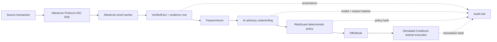

# ProofLoan

**ProofLoan** is a Creditcoin-branded cross-chain credit underwriting prototype for BUIDL CTC 2026 Fall. It turns an on-chain transaction history into a bounded, auditable loan decision through a deliberate trust boundary: evidence is verified by the Attestcoin Protocol, inference is advisory, RiskGuard is deterministic, and execution is constrained to a simulated Creditcoin testnet transaction boundary.

## Hackathon fit

ProofLoan targets the **AI / DeFi** intersection. The project meaningfully integrates the **Attestcoin Protocol** through an Attestcoin Protocol USC SDK adapter and the **Attestcoin proof worker** boundary. A proof request produces typed `VerifiedFact` records with source chain, source block, transaction hash, event type, amount, verification block, freshness, and proof root. Raw RPC responses are not admitted as financial truth.

The submission page requires working Attestcoin Protocol integration code, technical documentation, a GitHub repository with a README, a whitepaper or deck URL, and a prototype demo video. The official challenge brief also requires deployment to a testnet and evaluates the depth of Attestcoin Protocol utilization. See the [BUIDL CTC 2026 Fall brief](https://dorahacks.io/hackathon/buidl-ctc-2026-fall/detail) and the [Attestcoin Protocol USC SDK documentation](https://docs.creditcoin.org/creditcoin-usc/dapp-builder-infrastructure/usc-sdk).

## Demo flow

1. The borrower enters a wallet address and selects **Ethereum Sepolia** or **Polygon Amoy**.
2. The server dispatches a proof request through the typed Attestcoin Protocol USC SDK adapter and Attestcoin proof worker boundary.
3. The proof worker result is decoded into immutable-looking `VerifiedFact` records and a compact evidence root.
4. A typed `FeatureVector` covers repayment count, late payments, leverage ratio, wallet age, evidence count, freshness, and fixed 7 / 30 / 180-day volume windows.
5. The server-side AI underwriting engine returns calibrated 30-day and 90-day PD, confidence, a risk tier, and only the exact reason codes `STRONG_REPAYMENT_HISTORY`, `RECENT_LATE_PAYMENT`, `HIGH_LEVERAGE`, and `SPARSE_EVIDENCE`.
6. **RiskGuard** deterministically checks amount, LTV, rate, freshness, confidence, and pool liquidity before an offer is shown.
7. The borrower accepts the offer, after which the typed execution boundary records a simulated **Creditcoin testnet** transaction and appends the event to the audit trail.

The state labels are frozen to: `Intake`, `EvidencePending`, `EvidenceVerified`, `Scored`, `OfferPrepared`, `AwaitingAcceptance`, `Executed`, and `Rejected`.

## Architecture



The database schema contains `loan_applications`, `verified_facts`, `decisions`, and `offers`, with audit fields for evidence root, model version, policy hash, and decision hash. The current hackathon demo keeps the active snapshot in memory for fast preview iteration while the schema is ready for durable persistence and contract-backed testnet wiring.

## Local development

```bash
pnpm install
pnpm dev
```

Useful checks:

```bash
pnpm check
pnpm test
pnpm build
```

## Security posture

The AI model is never the financial oracle and never the signer. External text and raw source-chain payloads are treated as data. The policy layer owns the allowable action space, historical outputs retain their version and hash identifiers, and the execution path is only entered after offer acceptance and deterministic RiskGuard checks.

## Submission metadata

| Field | Value |
|---|---|
| Project | ProofLoan |
| Sector | AI / DeFi / RWA infrastructure |
| Network | Creditcoin testnet demo boundary |
| Cross-chain source | Ethereum Sepolia, Polygon Amoy |
| Protocol | Attestcoin Protocol |
| SDK | Attestcoin Protocol USC SDK |
| Proof component | Attestcoin proof worker |
| Policy component | RiskGuard |
| Execution | Simulated Creditcoin testnet transaction submission |


## Current demo boundary

The borrower intake accepts either a wallet address or a mined source transaction hash. A wallet address intentionally selects the labeled preview adapter so judges can run the end-to-end interface without external chain history. A 32-byte source transaction hash selects the official `@gluwa/usc-sdk` path: `ProofBuilder` requests an Attestcoin Protocol proof and `PrecompileBlockProver` verifies it against the Creditcoin testnet boundary. Live transaction-hash applications require database persistence before an offer is prepared; preview applications may use the in-memory fallback only when the managed database endpoint is unavailable.

The repository validates the core state machine and replay protection through Vitest, and the landing, intake, and documentation surfaces have been visually checked. A final browser click-through from proof request to Executed UI state should be run in a connected preview session before submission.
